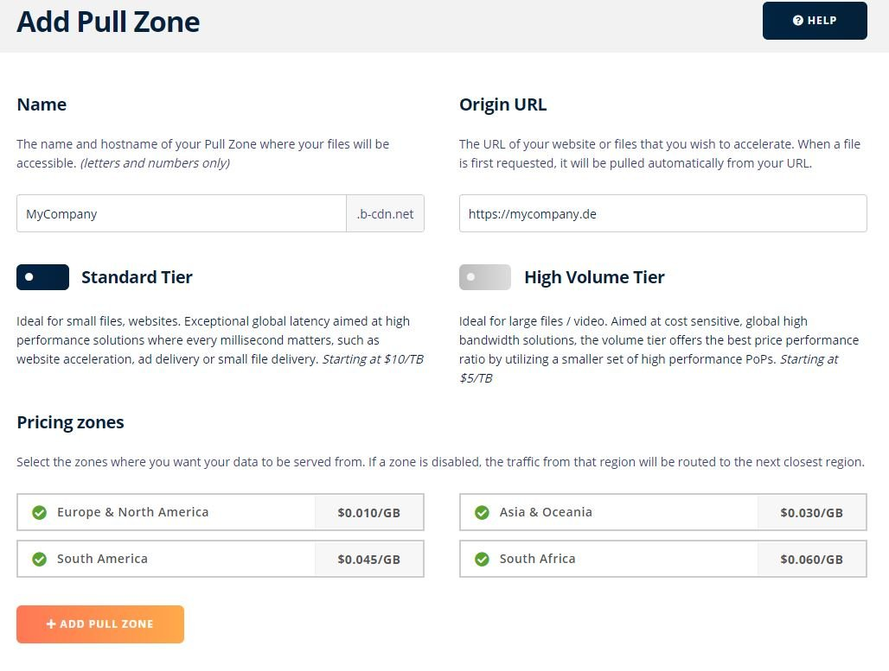
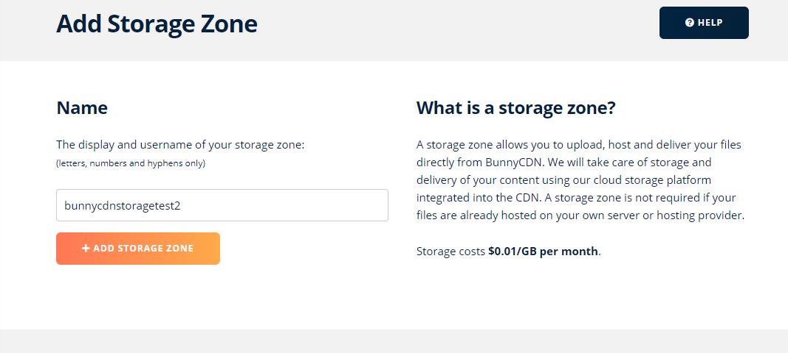
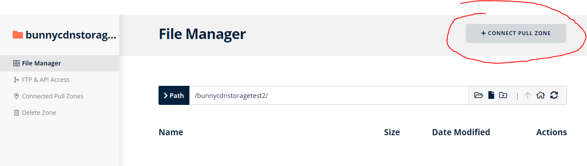
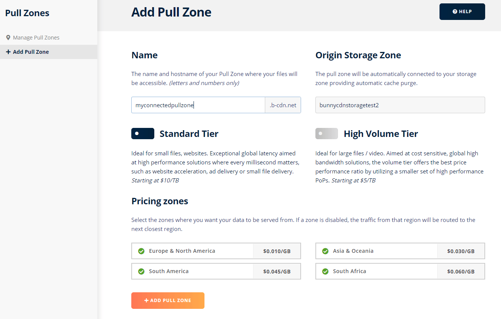

## A few words about CDN
What do you gain from using a CDN? Perhaps you are only active in German-speaking countries and simply don't know what you could gain from using it?

Many will have heard of Content Delivery Networks (CDN). Amazon, Google, Microsoft, virtually all the big players offer something like this. But there are also smaller providers on the market with clearer pricing policies and easier set-up.

Basically, CDNs are there to make the static files quickly available to every visitor of the site or shop, no matter on which continent. The providers achieve this through a multitude of servers distributed around the world.

There are two ways to make the files available to the CDN:

## Pull type
This type loads the file in real time from the shop as soon as the file is called once and then caches it. However, this happens per POP (location of the CDN server).

### Advantages
* You have the files in your own hands and on your own server.

### Disadvantages
* Due to the automatic caching, the initial call per POP is lame. This decelerates the initial call. Therefore, I do not recommend the pull method at all if the media files change often.
* In addition, the traffic of the own server is only noticeably reduced from the time when the files have all been called once and cached by the CDN.
* The storage space for the media folder is not saved, hence larger backups.

## Push type
With this type, the files do not have to be on the shop's server. They must be made available on an external storage device.

### Advantages
* Saving of storage space for the media folder.
* Extremely smaller backups due to saving the media folder.
* No long delay per POP.
* Complete traffic saved on the media folder.
* Can also be individualised by rules (Edge Rules). For example, fetching JS and CSS live from the server.

### Disadvantages
* Initially, the existing files must be loaded onto the external storage.
* Before termination, the files must first be available again on the server.

## Which CDN?
I don't want to make a pro and con list here, which is why I prefer one provider to all others. And I don't receive any money for naming it. I am only doing this because I am convinced of it. [BunnyCDN](https://bunnycdn.com/) has been in use the longest after several moves. The [traffic](https://bunnycdn.com/pricing) and especially the [storage space](https://bunnycdn.com/solutions/cdn-cloud-storage) are extremely cheap. In addition, the servers are extremely fast. While other providers have a limit of files and folders per storage, this is not the case with this provider.

## HowTo: BunnyCDN for your shop

### Pull type
After creating the account, create your pull zone under Pull Zones⇒ Create Zone ([Link](https://bunnycdn.com/dashboard/pullzones/add)).



You can choose the name freely. The name is part of the domain. The Origin URL is the address of the shop. This is where the CDN retrieves the files. See also in the [Support Hub of BunnyCDN](https://support.bunnycdn.com/hc/en-us/articles/207790269-How-to-create-your-first-Pull-Zone). Optionally, you can also add your own domain later. More about this [here](https://support.bunnycdn.com/hc/en-us/articles/207790279-How-to-set-up-a-custom-CDN-hostname).

#### Shopware 6

>! Attention ! This part is outdated! I will update it soon.

Edit the `shopware.yml` file in the `config/packages` subfolder of the shop. If the folder or file does not yet exist, you must create it. Add the block `cdn` after `shopware:` in a new line and adjust the values to the data of BunnyCDN.

```yaml
shopware:
  filesystem:
    public:
      type: "local"
      url: "https://mycdn.example.net"
      config:
        root: "%kernel.project_dir%/public"
    sitemap:
      type: "local"
      url: "https://mycdn.example.net"
      config:
        root: "%kernel.project_dir%/public"
    theme:
      type: "local"
      url: "https://mycdn.example.net"
      config:
        root: "%kernel.project_dir%/public"
    asset:
      type: "local"
      url: "https://mycdn.example.net"
      config:
        root: "%kernel.project_dir%/public"
```

Pay attention to the indentations. And ready!

### Push type (Storage)

Create your storage zone under Storage⇒ Add Storage Zone ([Link](https://bunnycdn.com/dashboard/storagezones/add)) with an individual name.


Now edit the storage zone and click on 'CONNECT PULL ZONE' in the upper right corner.


Create the pull zone. The name is part of the domain. Optionally, you can also add your own domain here later. More about this [here](https://support.bunnycdn.com/hc/en-us/articles/207790279-How-to-set-up-a-custom-CDN-hostname).


#### Shopware 6

A special adapter is necessary for processing the storage. This ensures that the files are transferred to BunnyCDN as soon as something is uploaded to the media management. You can download it here:
https://github.com/FriendsOfShopware/FroshPlatformBunnycdnMediaStorage/releases
Upload the downloaded ZIP archive in your plugin manager (shortcut: G A) of Shopware and then install and activate the plugin.

##### Migration

Upload the media folder of the shop manually via FTP to the BunnyCDN storage access data can be found in the storage settings.

After the migration, adjust the plugin configuration, save and delete the cache. And that's it!